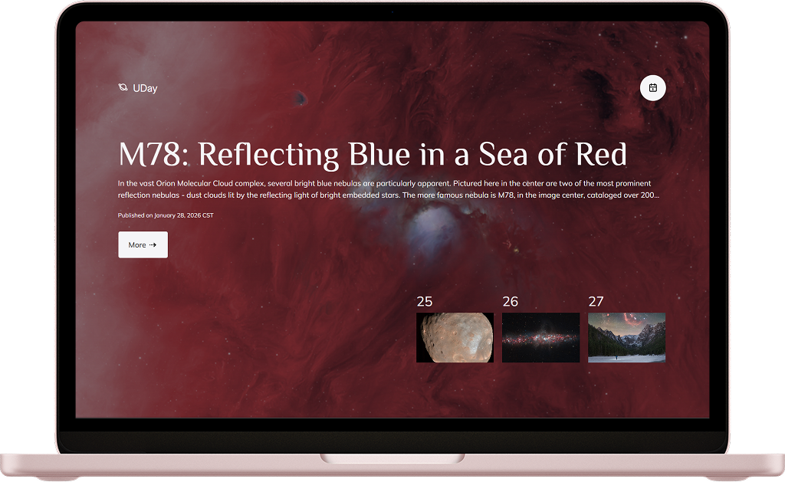

# UDay
A webpage that shows a different image of our universe each day, along with a brief
explanation written by a professional astronomer, using [NASA's APOD API](https://api.nasa.gov/#apod).

**Live demo:** https://ggandream.github.io/uday/

Built with vanilla JavaScript, no framework, no bundler, no build step.


### Screenshot



## Features

- **Picture of the day** as a full-bleed background, with title, explanation and publication date.
- **Date navigation** — pick any date between `1995-06-20` (the first APOD) and today.
- **Gallery** of the three previous days; each thumbnail links to that day.
- **Deep links & history** — the selected day lives in the URL (`?date=YYYY-MM-DD`), so
  back/forward and sharing work.
- **Video support** — MP4 files are rendered as `<video>`, YouTube links as an `<iframe>`.
- **Detail dialog** with the full-resolution media, explanation and copyright.
- **Caching** — recent days are stored in the browser so revisiting a date costs no API call.
- **Accessibility** — focus management on navigation, `role="alert"` errors, labelled
  controls and a visible focus ring.
- **Progressive enhancement** — uses the native `command`/`commandfor` and `closedby`
  dialog APIs, falling back to event listeners where unsupported.

## Getting started

### 1. Get a NASA API key

Request a free key at [api.nasa.gov](https://api.nasa.gov/). The demo key (`DEMO_KEY`)
also works but is heavily rate-limited.

### 2. Configure it

Set your key in [config.js](config.js):

```js
export const API_KEY = "your-api-key-here";
```

### 3. Serve the project

The app uses ES modules and `fetch()` for the SVG icons, so it must be served over HTTP —
opening `index.html` from the filesystem will not work.

```bash
npx serve .
# or
python3 -m http.server 8000
```

Then open the printed URL (e.g. `http://localhost:8000`).

> **Browser support:** the code relies on top-level `await`, JSON
> [import attributes](https://developer.mozilla.org/en-US/docs/Web/JavaScript/Reference/Statements/import#import_attributes)
> (`with { type: "json" }`) and `<dialog>`. A current version of Chrome, Edge, Firefox or
> Safari is required.

## Project structure

```
index.html          Entry point — loads every stylesheet and app.js
app.js              Data fetching, caching, routing, rendering and event wiring
config.js           NASA API key
styles.css          Design tokens (CSS custom properties), reset, body and loader
months.json         Month names used to format dates
data.json           Sample APOD response (single day), for reference
data2.json          Sample APOD response (date range), for reference

components/         One folder per component: <Name>.js + <name>.css
  Aside/            Detail dialog with full media and explanation
  Button/           Button with variants and optional icon
  DatePicker/       Calendar button + native date input
  errorMsg/         Error banner
  Gallery/          Horizontal strip of Slides
  Hero/             Title, explanation, publication date and "More" button
  Logo/             Planet icon + wordmark
  Nav/              Logo + DatePicker
  Slide/            Single gallery thumbnail, links to its date
  Text/             Paragraph with variants
  Title/            Heading with configurable level

functions/
  renderVideo.js    Picks <video> or <iframe> depending on the media URL

icons/              SVG icons, loaded at startup by icon.js
assets/             Fonts (Philosopher, Mulish, Inter) and fallback images
```

### How it renders

Components are plain functions that take props and return an HTML string:

```js
export function Title({ level = 1, children = "", lineclamp = false } = {}) {
  return `<h${level} class="title ${lineclamp ? "title--lines" : ""}" tabindex="-1">${children}</h${level}>`;
}
```

`app.js` composes those strings and injects them into `<main>`, then calls `appendEvent()`
to attach listeners to the freshly created DOM. Each component owns its stylesheet, linked
from `index.html` and written in BEM-ish class naming (`.slide`, `.slide__img`,
`.btn--primary`).

### Caching

| Storage          | Key              | Contents                                            |
| ---------------- | ---------------- | --------------------------------------------------- |
| `localStorage`   | `days-saved`     | The five most recently viewed single-day responses  |
| `sessionStorage` | `gallery_saved`  | Gallery ranges fetched during the current session   |

A date already present in storage is served from there instead of hitting the API.

## Scripts

```bash
npm install       # dev dependencies (ESLint only)
npm run lint      # check
npm run lint:fix  # check and autofix
```

## License

© Build by Andrea Garrido, design by Luis Granados.
